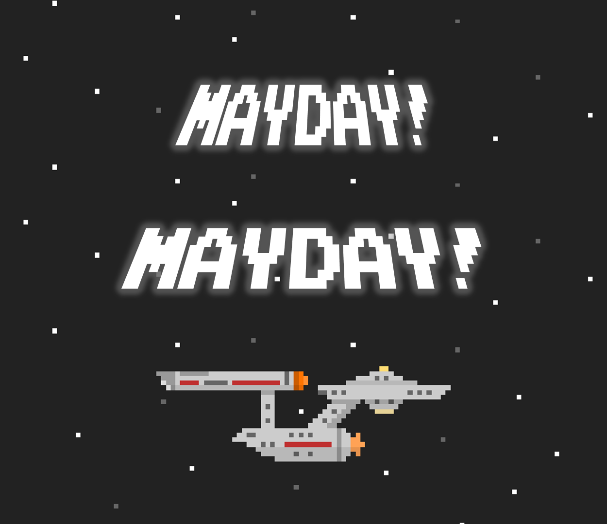
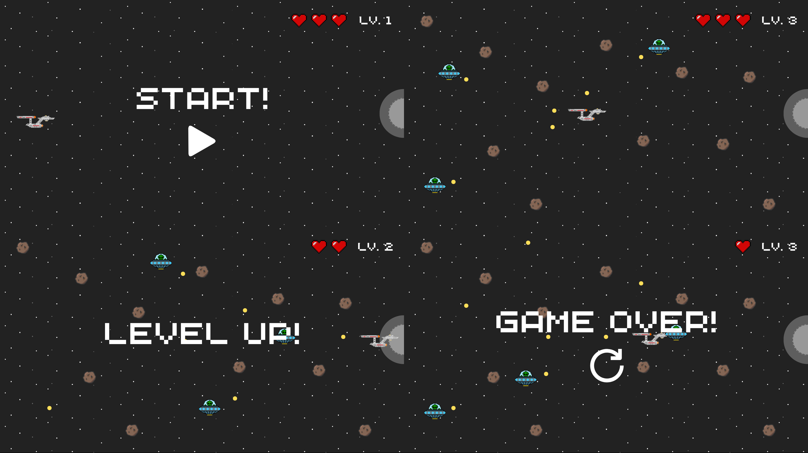
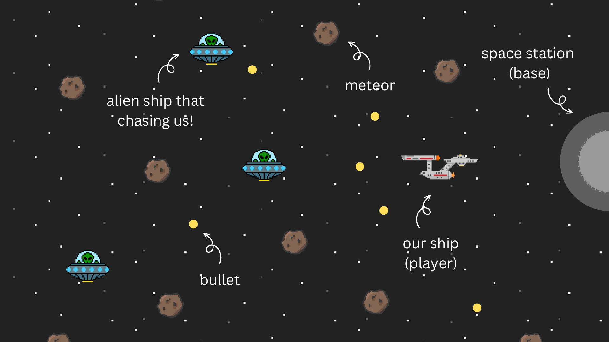
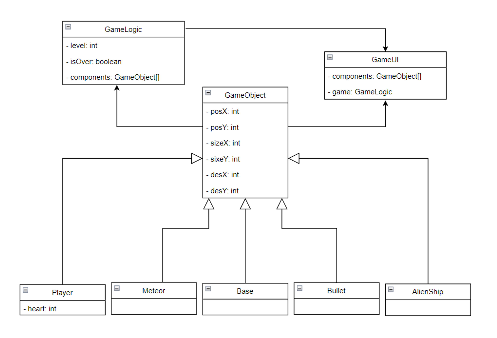

# **Mayday! Mayday!**

## **Project Description**
Our project is about a spaceship whose engine nearly dies! We have to help that spaceship get to the base safely. Between the route to base there will be meteors which randomly spawn and randomly move around the map and there will be the alien ship which is chasing the spaceship and every 5 seconds they will shoot the bullet to destroy us. Your task is guiding the spaceship to the base by clicking on the screen and trying to avoid all the collisions. You have 3 hearts, which means that you can let the spaceship hit another thing 2 times and the 3rd time you will lose the game!. But if you can go to the base safely all hearts will recover for the next level.

There are three levels in this game:
- **Level 1:** There will be just meteors on the map, which will spawn every second.
- **Level 2:** There will be alien ships chasing our ship, which will spawn every 2 seconds and it will shoot bullets at the player every 5 seconds; the most are 3 alien ships and the meteor.
- **Level 3:** There will be alien ships chasing our ship, which will spawn every 2 seconds and it will shoot bullets at the player every 5 seconds; the most are 5 alien ships and the meteor.

## **Running the Application**
To run the game, you should clone this project then open and run `main.Object.GameUI.java`.

For *better experience*, click [here](https://github.com/thanidacwn/Mayday-Mayday/raw/master/assets/ARCADECLASSIC.TTF) to download "Arcade Classic" font.

## **UI example**

These are all case of user interface.

This is all game object.

## **Use cases**

**Actors:** Player

**Preconditions:** The player has the game installed and is at the main menu.

**Normal Flow:**

1. The player clicks the "Start" button located at the center of the screen to start the game.
2. The player clicks on the screen to control the spaceship, navigating it towards the base to win the game.
3. The player must navigate the spaceship carefully to avoid obstacles that randomly spawn on the map. These obstacles include meteors, alien ships, and bullets.
4. The difficulty of the game depends on the level.
5. If the spaceship reaches the base without colliding with any obstacles, the game progresses to the next level, and the player receives a "Level up" message on the screen. Upon completing the last level, the player receives a "Victory" message.
6. The player starts with 3 hearts. If the player cannot avoid an obstacle, they lose a heart. The number of hearts resets to 3 every time the player levels up.
7. If the spaceship collides with obstacles and the player loses all 3 hearts, the game is lost. The player receives a "Game Over" message with the option to restart.

**Postconditions:**
The player has either won the game, lost the game, or decided to exit the game.

## **Domain model**

## **Design pattern**
- **Factory Method:** Implement the Factory Method pattern for creating game objects such as Meteors, AlienShips, and Bullets. This pattern allows to define an interface for creating objects in a superclass, but lets subclasses decide which class to instantiate.
- **Singleton:** Use the Singleton pattern for the Game class to ensure there's only one instance of the game at any given time. This instance will manage the game state, heart, level, and control the game loop.
- **Strategy:** Use the Strategy pattern to define various movement and behavior strategies for game objects like the Player, Meteors, and AlienShip. This pattern allows to change the behavior of game objects at runtime, making it easier to add new behaviors or modify existing ones.

---
